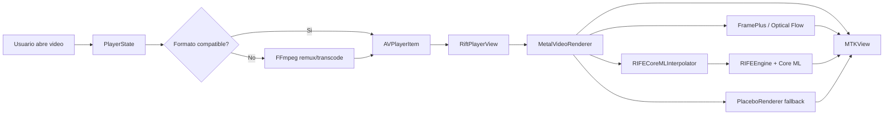

# Rift

> Reproductor de video para macOS construido con SwiftUI, AVFoundation, Metal y Core ML. Rift busca una experiencia de reproduccion fluida, visualmente cuidada y preparada para interpolacion de frames en tiempo real.


## Vision General

Rift es una aplicacion de escritorio para reproducir video en macOS con una interfaz moderna tipo "liquid glass" y un pipeline de renderizado pensado para aprovechar Apple Silicon. El proyecto combina reproduccion nativa con `AVPlayer`, renderizado sobre `MTKView`, interpolacion de movimiento con Metal/Vision/Core ML y conversion auxiliar con FFmpeg cuando el contenedor de video necesita compatibilidad.

El objetivo no es solo abrir un archivo de video: Rift inspecciona metadata, prepara formatos complicados, muestra informacion de codecs/FPS, permite controlar audio y subtitulos, aplica mejoras visuales y puede generar frames intermedios para una sensacion de movimiento mas suave.

## Que Hace

| Area | Descripcion |
| --- | --- |
| Reproduccion de video | Carga archivos locales desde selector, drag and drop o argumentos de linea de comandos. |
| Interfaz macOS | UI nativa en SwiftUI con paneles transluidos, controles auto-ocultables y atajos de reproduccion. |
| Renderizado GPU | Presenta frames en un `MTKView` usando Metal, Core Image y texturas GPU. |
| Interpolacion de frames | Incluye modos de interpolacion como `Motion² Intenso`, RIFE 2x, RIFE 4x y modo adaptativo. |
| Core ML | Carga un modelo `RIFE.mlpackage`, lo compila si hace falta y ejecuta inferencia con CPU/GPU. |
| Optical Flow | Usa Vision para estimar flujo optico y alimentar interpolacion basada en movimiento. |
| Mejoras visuales | Aplica reduccion de ruido, sharpening, tone mapping HDR y ajuste de color via Core Image. |
| Compatibilidad de formatos | Convierte/remuxea MKV, WebM, AVI, FLV, WMV, TS y M2TS a MP4 cuando AVFoundation lo necesita. |
| Audio y subtitulos | Detecta pistas de audio/subtitulos, permite seleccionar pistas y evita audio duplicado con `AVAudioMix`. |
| Benchmarks | Incluye pruebas para medir latencia RIFE por resolucion, throughput y memoria residente. |

## Tecnologias Usadas

### Lenguaje y Plataforma

- **Swift 6.0**: lenguaje principal del proyecto.
- **Swift Package Manager**: definicion del paquete, dependencias, recursos y tests.
- **macOS 14+**: plataforma minima configurada en `Package.swift`.
- **SwiftUI**: interfaz, estado, controles y composicion visual.
- **AppKit**: integracion con ventanas, icono de app, apertura de archivos y ciclo de vida macOS.

### Video, Audio y Media

- **AVFoundation**: reproduccion con `AVPlayer`, lectura de assets, pistas, duracion, volumen, seek y audio mix.
- **AVAssetReader**: decodificacion frame a frame para pipelines avanzados.
- **CoreMedia / CoreVideo**: timestamps, `CVPixelBuffer`, pools de buffers y metadata HDR.
- **VideoToolbox**: enlazado para capacidades de video aceleradas por hardware.
- **FFmpeg / FFprobe**: inspeccion de codecs y conversion/remux de contenedores no ideales para AVFoundation.
- **KSPlayer**: dependencia de media declarada en el paquete para soporte del ecosistema de reproduccion.

### GPU, Imagen e Interpolacion

- **Metal / MetalKit**: renderizado en `MTKView`, command queues, texturas y compute pipelines.
- **Metal Performance Shaders**: framework enlazado para trabajo GPU especializado.
- **Core Image**: filtros, escalado, color, tone mapping y render a texturas Metal.
- **Vision Optical Flow**: generacion de mapas de movimiento entre frames.
- **Core ML**: carga y ejecucion de modelo RIFE para interpolacion neural.
- **Accelerate**: soporte numerico de alto rendimiento.

### Scripts y Herramientas

- **Python + coremltools**: conversion de checkpoints RIFE v4.x a `.mlpackage`.
- **PyTorch**: carga/trazado del modelo RIFE antes de exportarlo a Core ML.
- **Swift scripts**: generacion de assets auxiliares para empaquetado DMG.
- **XCTest**: benchmarks y pruebas de helpers PSNR/SSIM.

## Arquitectura



## Modulos Principales

| Archivo | Responsabilidad |
| --- | --- |
| `Sources/Rift/RiftApp.swift` | Punto de entrada, ciclo de vida de la app, apertura por CLI/Finder y ventana principal. |
| `Sources/Rift/ContentView.swift` | Composicion principal de UI, drag and drop, prompt de apertura y controles flotantes. |
| `Sources/Rift/PlayerState.swift` | Estado del reproductor, carga de videos, conversion FFmpeg, metadata, audio, tiempo y FPS. |
| `Sources/Rift/PlayerControlsView.swift` | Barra de control: timeline, volumen, play/pause, seek, velocidad, visuales, audio y subtitulos. |
| `Sources/Rift/RiftPlayerView.swift` | Puente SwiftUI/AppKit hacia `MTKView` y renderer Metal. |
| `Sources/Rift/FramePipeline.swift` | Buffer lock-free y prefetcher de frames para alimentar renderizado fluido. |
| `Sources/Rift/VideoDecoderEngine.swift` | Decodificacion frame a frame con `AVAssetReader` y lectura de pistas/media metadata. |
| `Sources/Rift/VideoInterpolationPipeline.swift` | Pipeline asincrono de interpolacion RIFE/adaptativa y emision de frames renderizables. |
| `Sources/Rift/RIFECoreMLInterpolator.swift` | Localiza, compila y administra el modelo RIFE bundled o definido por entorno. |
| `Sources/Rift/RIFEEngine.swift` | Actor de inferencia Core ML, padding/cropping, pools de pixel buffers y metricas de latencia. |
| `Sources/Rift/OpticalFlowEngine.swift` | Calculo de optical flow con Vision en cola dedicada. |
| `Sources/Rift/FramePlusMEMCEngine.swift` | Interpolacion MEMC con compute shaders Metal. |
| `Sources/Rift/FramePlusMEMC.metal` | Kernels GPU para downsample, estimacion de movimiento, filtrado y warp. |
| `Sources/Rift/PlaceboRenderer.swift` | Pipeline visual de fallback: deband, sharpening, tone mapping y color management. |

## Flujo de Reproduccion

1. El usuario abre un archivo desde el selector, lo arrastra a la ventana o lo pasa como argumento.
2. `PlayerState` reinicia estado, limpia conversiones temporales y detecta si el contenedor requiere conversion.
3. Si el archivo es MKV/WebM/AVI/FLV/WMV/TS/M2TS, se usa FFmpeg para remux o transcode a MP4 temporal.
4. Se inspeccionan codecs, resolucion y frame rate con FFprobe cuando esta disponible.
5. `AVPlayer` reproduce el archivo y mantiene sincronizados tiempo, volumen, velocidad y estado.
6. `RiftPlayerView` entrega frames al renderer Metal.
7. El renderer decide si presenta FPS nativo, interpolacion Motion², RIFE o fallback visual.
8. La UI recibe estadisticas de FPS, uso de optical flow, fallback e informacion del modelo RIFE.

## Interpolacion y FPS

Rift tiene dos grandes caminos para mejorar la fluidez:

- **Motion² Intenso**: modo orientado a 60 FPS con estimacion de movimiento, optical flow y shaders Metal. Es el modo por defecto configurado en el estado del reproductor.
- **RIFE Core ML**: interpolacion neural usando un modelo `RIFE.mlpackage`. Soporta `RIFE 2x`, `RIFE 4x` y `Adaptive`, con control de timesteps segun latencia.

El pipeline puede degradar con gracia: si no existe modelo RIFE, si el modelo falla o si la resolucion excede el limite soportado, la app desactiva ese modo y vuelve a reproduccion nativa o al fallback disponible.

## Mejoras Visuales

El renderer visual aplica pases de imagen enfocados en calidad:

- ajuste de imagen al target manteniendo aspect ratio;
- reduccion suave de ruido;
- sharpening luminance para escaladores tipo Lanczos/Jinc;
- tratamiento HDR con ajustes de highlights/shadows;
- seleccion automatica de espacio de color SDR, HDR10 o Display P3.

## Compatibilidad de Formatos

AVFoundation reproduce muy bien MP4/MOV y codecs compatibles con macOS. Para otros contenedores, Rift intenta preparar una copia temporal:

- si video y audio son compatibles, hace **remux** sin recodificar;
- si el video es compatible pero el audio no, copia video y convierte audio a AAC;
- si hace falta, usa **h264_videotoolbox** para conversion acelerada por hardware;
- si falla el hardware, cae a **libx264** como opcion compatible.

Formatos que disparan preparacion: `mkv`, `webm`, `avi`, `flv`, `wmv`, `ts`, `m2ts`.

## Requisitos

- macOS 14 o superior.
- Xcode con toolchain Swift 6.
- Apple Silicon recomendado para los modos de interpolacion y Core ML.
- FFmpeg opcional, pero recomendado para contenedores como MKV/WebM:

```bash
brew install ffmpeg
```

## Instalacion y Ejecucion

Clona el repositorio y compila la app:

```bash
swift build
```

Ejecuta Rift desde Swift Package Manager:

```bash
swift run Rift
```

Tambien puedes abrir un video directamente:

```bash
swift run Rift /ruta/al/video.mkv
```

Para activar el modo Flux desde CLI:

```bash
swift run Rift --fps=60 /ruta/al/video.mp4
```

## Modelo RIFE

Rift busca el modelo con este orden:

1. variable de entorno `RIFE_MODEL_URL`;
2. `RIFE.mlmodelc`, `RIFE.mlpackage` o `RIFE.mlmodel` dentro del bundle;
3. el subdirectorio `Resources` del bundle.

Ejemplo con modelo externo:

```bash
RIFE_MODEL_URL=/ruta/a/RIFE.mlpackage swift run Rift /ruta/al/video.mp4
```

El repositorio incluye un script para convertir checkpoints RIFE v4.x a Core ML:

```bash
python3 -m venv .venv-rife
source .venv-rife/bin/activate
pip install --upgrade pip
pip install torch torchvision coremltools==7.2 pillow numpy
PYTHONPATH=/ruta/a/rife python scripts/convert_rife_v4_coreml.py \
  --checkpoint /ruta/a/flownet.pkl \
  --rife-root /ruta/a/rife \
  --output Sources/Rift/Resources/RIFE.mlpackage
```

## Tests y Benchmarks

Ejecuta la suite base:

```bash
swift test
```

Ejecuta el benchmark de latencia RIFE con un modelo especifico:

```bash
RIFE_MODEL_URL=/ruta/a/RIFE.mlpackage \
swift test --filter RIFEEngineBenchmarks/testRIFELatencyMatrix
```

El benchmark mide resoluciones desde 360p hasta 4K e imprime p50, p95, p99, throughput, memoria residente y temperatura cuando este disponible.

## Empaquetado

El proyecto contiene una app ya empaquetable como `Rift.app` y un artefacto `Rift.dmg`. Tambien hay scripts auxiliares para assets de distribucion, como el fondo del DMG:

```bash
swift scripts/make_dmg_background.swift /ruta/de/salida/background.png
```

## Estructura del Repositorio

```text
.
├── Package.swift
├── Package.resolved
├── Sources/
│   └── Rift/
│       ├── *.swift
│       ├── FramePlusMEMC.metal
│       └── Resources/
│           └── RIFE.mlpackage
├── Tests/
│   └── RiftTests/
├── scripts/
│   ├── convert_rife_v4_coreml.py
│   └── make_dmg_background.swift
├── external/
│   └── rife-4.25-lite/
├── Rift.app
└── Rift.dmg
```

## Estado del Proyecto

Rift ya cuenta con una base funcional de reproductor, UI, reproduccion local, conversion auxiliar, renderizado Metal, interpolacion experimental y benchmarks. El modelo Core ML necesario para RIFE esta incluido en `Sources/Rift/Resources/RIFE.mlpackage`, por lo que no hace falta clonar repositorios externos para ejecutar la app. Las areas con mayor potencial de evolucion son:

- estabilizar y perfilar los modos RIFE en mas resoluciones;
- ampliar soporte de subtitulos visibles en el pipeline de render;
- mejorar la integracion de libplacebo real si se reemplaza el fallback Core Image;
- automatizar empaquetado, firma y notarizacion;
- agregar pruebas de UI y pruebas de reproduccion con archivos fixture.

## Licencias y Dependencias Externas

El proyecto usa dependencias y modelos externos que pueden tener licencias propias. Revisa especialmente:

- `KSPlayer`;
- FFmpeg y codecs enlazados o usados localmente;
- checkpoints RIFE externos usados para regenerar el modelo Core ML;
- frameworks incluidos dentro de `Rift.app`.

Antes de distribuir builds publicos, valida compatibilidad de licencias, atribuciones y terminos de redistribucion de modelos y librerias nativas.

---

Hecho para explorar video fluido en macOS con una mezcla potente de SwiftUI, GPU y modelos de interpolacion.
